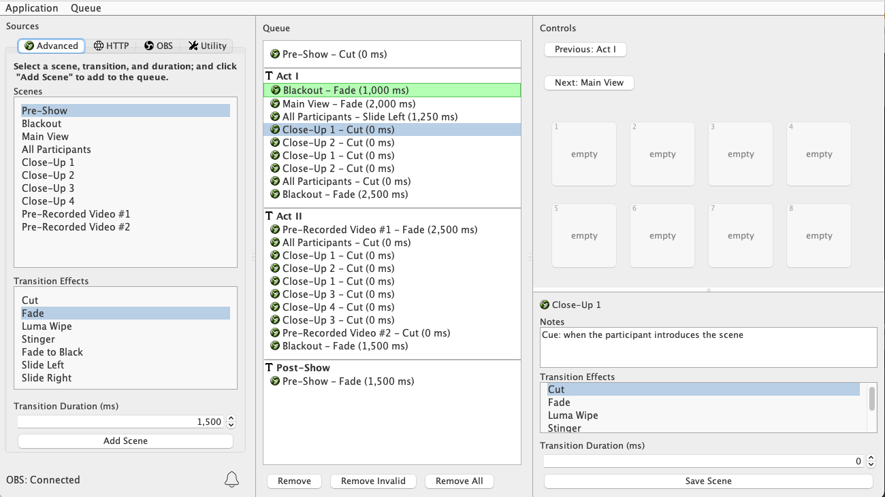

# OBS Advanced Scene Queue

OBS Advanced Scene Queue is an advanced sequential cueing plugin for @sampie777's 
[OBS Scene Queue](https://github.com/sampie777/obs-scene-que).

## Use Cases

This plugin integrates with OBS via [OBS Websocket](https://github.com/Palakis/obs-websocket) to let a user configure
a full listing of cues, each with:

* A Scene (based on configured scenes in OBS)
* Transition Type (based on configured transitions in OBS)
* Transition Duration (in milliseconds)

In addition, it allows the user to update scene transitions & durations, and write notes after those scenes have been 
created.

## Requirements
* [OBS](https://obsproject.com/)
* [OBS Websocket](https://github.com/Palakis/obs-websocket) >= v4.1.0
* [OBS Scene Queue](https://github.com/sampie777/obs-scene-que) (tbd)
* Java 8

## Project Status

This project currently depends on a custom build of [OBS Scene Queue](https://github.com/sampie777/obs-scene-que) and 
thus may not be ready for standard users to use it at this time.